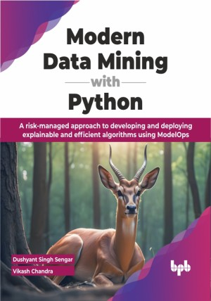

# Modern Data Mining with Python

Data miner’s survival kit for explainable, effective, and efficient algorithms enabling responsible decision-making

This is the repository for [Modern Data Mining with Python
](https://bpbonline.com/products/modern-data-mining-with-python?variant=43252988477640),published by BPB Publications. The code bundles of this book are available here: https://rebrand.ly/9b9424

## About the Book
"Modern Data Mining with Python" is a guidebook for responsibly implementing data mining techniques that involve collecting, storing, and analyzing large amounts of structured and unstructured data to extract useful insights and patterns.
 
Enter into the world of data mining and machine learning. Use insights from various data sources, from social media to credit card transactions. Master statistical tools, explore data trends, and patterns. Understand decision trees and artificial neural networks (ANNs). Manage high-dimensional data with dimensionality reduction. Explore binary classification with logistic regression. Spot concealed patterns with unsupervised learning. Analyze text with recurrent neural networks (RNNs) and visuals with convolutional neural networks (CNNs). Ensure model compliance with regulatory standards.
 
After reading this book, readers will be equipped with the skills and knowledge necessary to use Python for data mining and analysis in an industry set-up. They will be able to analyze and implement algorithms on large structured and unstructured datasets.

## What You Will Learn
• Explore the data mining spectrum ranging from data exploration and statistics.

• Gain hands-on experience applying modern algorithms to real-world problems in the financial industry.

• Develop an understanding of various risks associated with model usage in regulated industries.

• Gain knowledge about best practices and regulatory guidelines to mitigate model usage-related risk in key banking areas.

• Develop and deploy risk-mitigated algorithms on self-serve ModelOps platforms.
